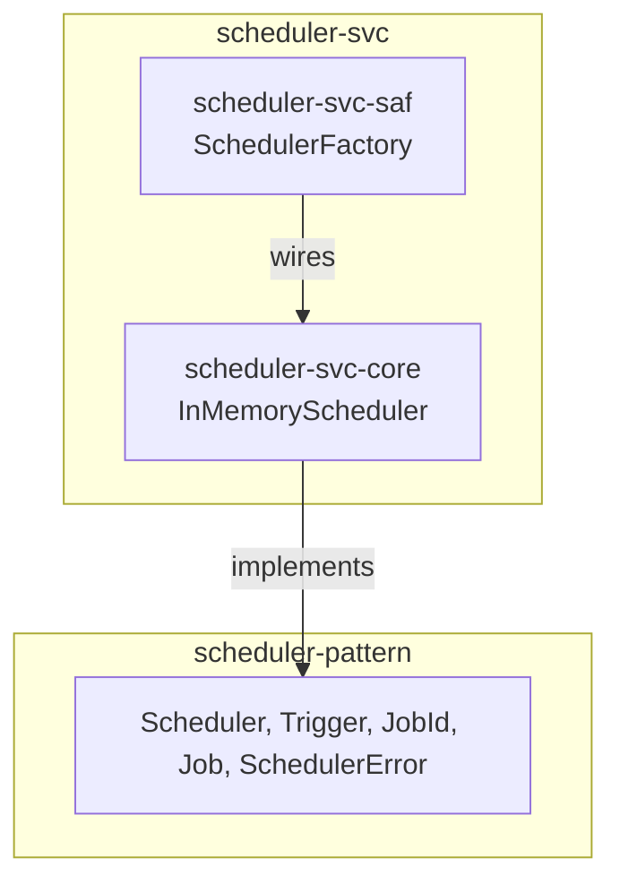

# scheduler-svc Architecture

**Audience**: Architects, technical leads, contributors.

## Overview

Two crates — one `core` reference implementation, one `saf` facade. No
`spi` crate yet:

- **`scheduler-svc-core`** — the technology-free reference implementation:
  `InMemoryScheduler` (one dedicated OS thread per scheduled job, no
  persistence, no distributed coordination). See
  [ADR-001](adr/ADR-001-in-memory-reference-implementation.md) for the
  implementation-shape reasoning.
- **`scheduler-svc-saf`** — `SchedulerFactory` (`in_memory`, always
  available — no feature gate, since there's only one backend). A consumer
  depends on `scheduler-pattern` + `scheduler-svc-saf` alone.

## `Scheduler` is object-safe, but `SchedulerFactory` doesn't use that

`Scheduler::schedule`/`::cancel` have no generic parameters (`Job` is
already a concrete `Arc<dyn Fn() -> ...>` type alias, not a generic bound),
so `Scheduler` is fully object-safe: `Box<dyn Scheduler>` would compile.
`SchedulerFactory::in_memory()` doesn't return it, though — see [scheduler-svc#2](https://github.com/sweengineeringlabs/scheduler-svc/issues/2)
(a zero-cost abstraction review): with exactly one backend and no caller
today that needs to pick a `Scheduler` implementation at runtime, boxing
would only pay a heap allocation and a vtable indirection for the
scheduler's whole lifetime with nothing to show for it. `in_memory()`
returns `impl Scheduler` instead — zero-cost, matching
`executor-svc-saf`'s `ExecutorFactory` shape, even though `Scheduler`
(unlike `Executor::run<F: Future>`) isn't generic and doesn't strictly
require it. If a second backend is ever added and a caller genuinely needs
to select between backends at runtime (not just at compile time via which
constructor it calls), revisit this with that real caller in view — not
before.

## Component Diagram

## Why no `spi` crate yet

No real consumer has needed a persistent (survives process restart) or
distributed (coordinates across multiple processes) scheduling backend. Per
this org's own `<domain>-<technology>-spi` convention, an `spi` crate wraps
exactly one external technology — building one speculatively, with no real
technology chosen and no real consumer validating the choice, would be the
same premature-generalization mistake `scheduler-pattern`'s own ADR-001
declined to make for cron-expression triggers. Add one when a real need
does.

## Scope boundary

This repo implements exactly `scheduler-pattern`'s `Scheduler` trait, one
backend. Not covered, deliberately:

- **Persistent/distributed scheduling backends** — no `spi` crate yet, see
  above.
- **Using `executor-pattern`/`executor-svc` internally to run fired jobs**
  — considered and deferred, see ADR-001's own reasoning.

[← Docs index](../README.md)
