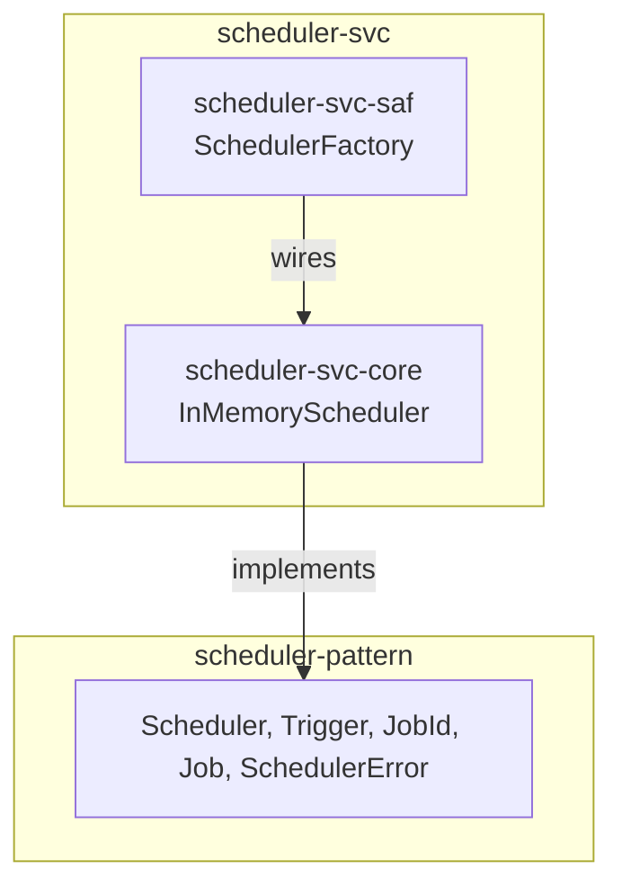

# scheduler-svc Architecture

**Audience**: Architects, technical leads, contributors.

## Overview

Two crates — one `core` reference implementation, one `saf` facade. No
`spi` crate yet:

- **`scheduler-svc-core`** — the technology-free reference implementation:
  `InMemoryScheduler` (one dedicated OS thread per scheduled job, no
  persistence, no distributed coordination). See
  [ADR-001](adr/ADR-001-in-memory-reference-implementation.md) for the
  implementation-shape reasoning.
- **`scheduler-svc-saf`** — `SchedulerFactory` (`in_memory`, always
  available — no feature gate, since there's only one backend). A consumer
  depends on `scheduler-pattern` + `scheduler-svc-saf` alone.

## `Scheduler` is object-safe — unlike `executor-pattern`'s `Executor`

`Scheduler::schedule`/`::cancel` have no generic parameters (`Job` is
already a concrete `Arc<dyn Fn() -> ...>` type alias, not a generic bound),
so `Scheduler` is fully object-safe: `Box<dyn Scheduler>` exists.
`SchedulerFactory::in_memory()` returns `Box<dyn Scheduler>` uniformly,
matching `message-broker-svc-saf`'s `MessageBrokerFactory` shape — unlike
`executor-svc-saf`'s `ExecutorFactory`, which must return `impl Executor`
per constructor because `Executor::run<F: Future>` is generic. Worth
stating explicitly: these are two sibling `-svc` repos in this org with
genuinely different object-safety constraints, not an inconsistency to
"fix" toward matching each other.

## Component Diagram

## Why no `spi` crate yet

No real consumer has needed a persistent (survives process restart) or
distributed (coordinates across multiple processes) scheduling backend. Per
this org's own `<domain>-<technology>-spi` convention, an `spi` crate wraps
exactly one external technology — building one speculatively, with no real
technology chosen and no real consumer validating the choice, would be the
same premature-generalization mistake `scheduler-pattern`'s own ADR-001
declined to make for cron-expression triggers. Add one when a real need
does.

## Scope boundary

This repo implements exactly `scheduler-pattern`'s `Scheduler` trait, one
backend. Not covered, deliberately:

- **Persistent/distributed scheduling backends** — no `spi` crate yet, see
  above.
- **Using `executor-pattern`/`executor-svc` internally to run fired jobs**
  — considered and deferred, see ADR-001's own reasoning.

[← Docs index](../README.md)
